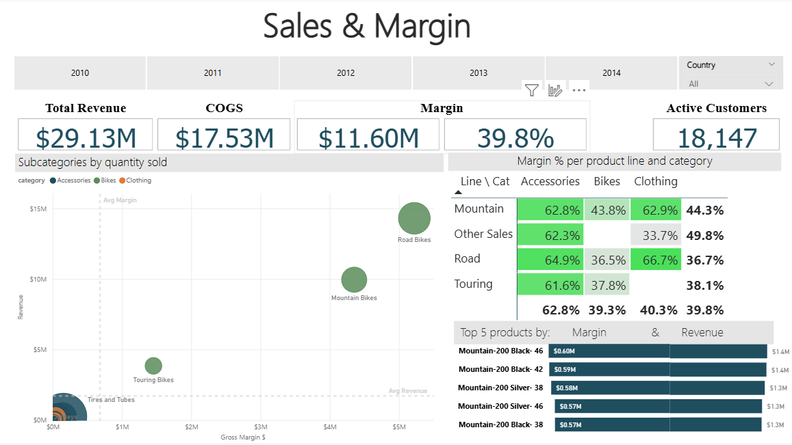
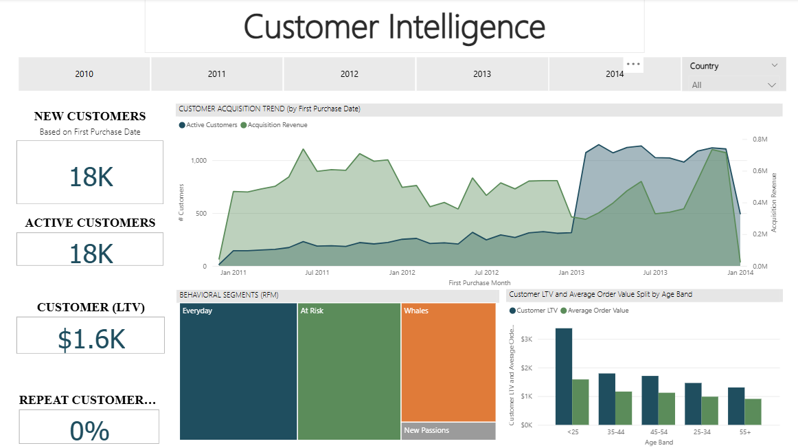
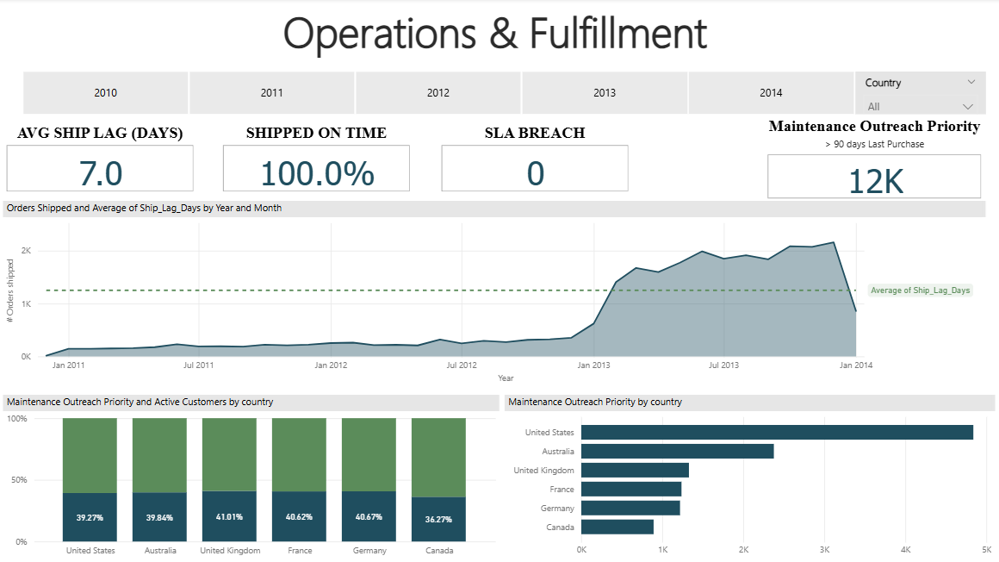

# Phase 2 - Business Intelligence

> Three Power BI dashboards built on the gold-layer star schema, serving the CFO, CMO, COO, and VP Merchandising. Built with DAX measures, a custom theme, and a derived RFM segmentation table.

## At a Glance

The .pbix file in [`pbix/`](pbix/) contains three executive-ready dashboards plus supporting model tables. Each dashboard targets a specific stakeholder and answers one or two of the project's five business questions.

| Dashboard | Primary stakeholder | Business questions answered |
|---|---|---|
| **Sales & Margin** | CFO, VP Merchandising | Margin by product line x region; top products; revenue vs margin scatter |
| **Customer Intelligence** | CMO | RFM segments; demographics; premium-bike buyer profile; new customer acquisition |
| **Operations & Fulfillment** | COO, Customer Service | Ship lag by region; seasonality; maintenance-eligible base |

## Dashboards

### Dashboard 1- Sales & Margin
*Audience: CFO, VP Merchandising*

Shows revenue, gross margin, and average order value across product lines and regions. The margin heatmap pinpoints where the company is underpriced relative to cost.

### Dashboard 2 - Customer Intelligence
*Audience: CMO*

Surfaces the customer base: new vs. active customers (using first-purchase date - see [data quality findings](../docs/03_data_quality_findings.md)), behavioral segments via RFM (Whales, Everyday, At Risk, New Passions), and LTV / AOV by age band.

### Dashboard 3 - Operations & Fulfillment
*Audience: COO, Customer Service Director*

Tracks order-to-ship lag by region and product line, seasonal volume patterns, and the maintenance-eligible customer base for service team outreach.

## Data Model

Classic star schema with one fact and three dimensions:

- **fact_sales** - sales transactions
- **dim_customers** - customer master
- **dim_products** - product catalogue
- **Date** - calendar table marked as Date Table

Plus two supporting tables:
- **_Measures** - dedicated container for all DAX measures
- **Customer_RFM** - derived table containing each customer's Recency, Frequency, Monetary scores and assigned RFM_Segment label

## DAX Measures

The report defines 20+ DAX measures organized into four categories:

- **Sales metrics:** Revenue, COGS, Gross Margin, Gross Margin %, AOV, Quantity Sold
- **Customer metrics:** Active Customers, New Customers, Customer LTV, Repeat Customer Rate
- **Operations metrics:** Ship Lag (days), % Shipped On Time, Maintenance-Eligible Customers
- **Time intelligence:** Revenue LY, Revenue YoY %, Gross Margin % YoY

Full documentation in `docs/DAX_MEASURES.md`.

## Key Design Decisions

### Star Schema, Not Snowflake
Star schemas (denormalized dimensions) outperform snowflake schemas in Power BI's VertiPaq engine. DAX measures are also simpler to write against a star schema.

### Inactive Relationships for Multiple Dates
`fact_sales` has three date columns: `order_date` (active), plus `ship_date` and `due_date` (inactive). DAX measures use `USERELATIONSHIP` to switch contexts when measuring fulfillment performance vs. revenue.

### "New Customer" Defined via First-Purchase Date
The source `dim_customers.create_date` is contaminated with warehouse-load timestamps (all 2025-2026), making it unusable for cohort analysis. New customer acquisition is therefore derived from the first transaction in `fact_sales` per customer. See [data quality findings](../docs/03_data_quality_findings.md).

## How to Open the Report

1. Install **Power BI Desktop** (free, Windows only): [powerbi.microsoft.com/desktop](https://powerbi.microsoft.com/desktop/)
2. Clone or download this repository
3. Open `pbix/AdventureWorks_Analytics.pbix` in Power BI Desktop

## Tech Stack

Power BI Desktop · DAX · M (Power Query)

## What's Next

The dashboards establish the descriptive and diagnostic baseline. [Phase 3 (Machine Learning)](../03_machine_learning/) extends with predictive and prescriptive analytics.

See the [top-level README](../README.md) for the overall project context.
