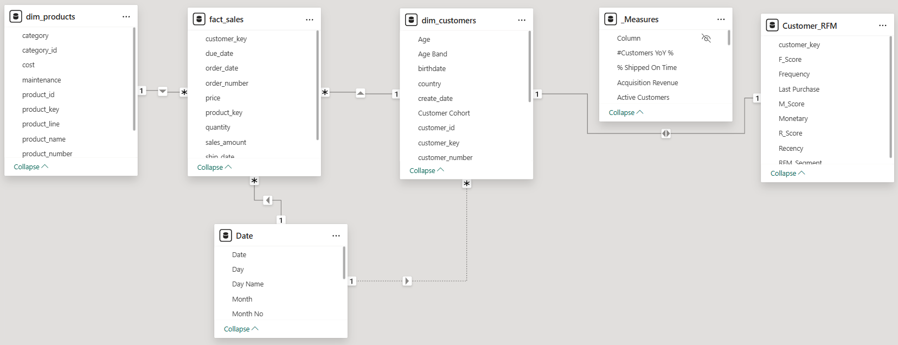

# Data Model — Star Schema

The Power BI report uses a classic star schema centered on a single fact table, with two business dimensions and one calendar dimension. Two supporting tables (`_Measures` and `Customer_RFM`) live outside the star but are essential to how the model functions.

## Visual Overview



## Tables

### Fact Table

| Table | Role | Granularity | Approx. rows |
|---|---|---|---|
| `fact_sales` | Sales transactions | One row per order line | ~60,000 |

Key columns: `order_number`, `product_key` (FK), `customer_key` (FK), `order_date`, `ship_date`, `due_date`, `sales_amount`, `quantity`, `price`.

### Dimension Tables

| Table | Role | Approx. rows |
|---|---|---|
| `dim_customers` | Unified customer master (CRM identity + ERP demographics) | ~18,500 |
| `dim_products` | Active product catalogue with category hierarchy | ~295 |
| `Date` | Calendar table (marked as Date Table in Power BI) | ~1,825 (5 years daily) |

### Supporting Tables

| Table | Role |
|---|---|
| `_Measures` | Empty container table dedicated to organizing all DAX measures |
| `Customer_RFM` | Calculated table with Recency, Frequency, Monetary scores and `RFM_Segment` label per customer |

## Relationships

The model uses both **active** and **inactive** relationships to handle multiple date columns in `fact_sales`.

### Active Relationships (solid lines in the diagram)

| From | To | Cardinality | Cross-filter direction |
|---|---|---|---|
| `fact_sales[customer_key]` | `dim_customers[customer_key]` | Many-to-One | Single (dim → fact) |
| `fact_sales[product_key]` | `dim_products[product_key]` | Many-to-One | Single (dim → fact) |
| `fact_sales[order_date]` | `Date[Date]` | Many-to-One | Single (Date → fact) |

### Inactive Relationships (dotted lines)

| From | To | When activated |
|---|---|---|
| `fact_sales[ship_date]` | `Date[Date]` | When measuring fulfillment timing |
| `fact_sales[due_date]` | `Date[Date]` | When measuring on-time delivery vs. due date |
| `dim_customers[create_date]` | `Date[Date]` | Originally for customer acquisition cohort analysis — DEPRECATED due to data quality issue (see below) |

DAX measures that need an inactive relationship use `USERELATIONSHIP` to switch contexts:

```dax
Ship Lag =
CALCULATE (
    AVERAGEX (
        fact_sales,
        DATEDIFF ( fact_sales[order_date], fact_sales[ship_date], DAY )
    )
)
```

## Key Design Decisions

### Star, Not Snowflake
The dimensions are denormalized. `dim_products` includes the full category hierarchy (category, subcategory) inline rather than splitting them into separate tables. Power BI's VertiPaq engine performs significantly better on stars; DAX measures are also simpler to write.

### Surrogate Keys
Both dimensions use surrogate integer keys (`customer_key`, `product_key`) instead of the natural source-system identifiers. This insulates the fact table from changes in source-system identifiers and supports slowly-changing-dimension patterns if needed later.

### Date Table Marked as Date
The `Date` table is explicitly marked as a Date Table (Modeling → Mark as date table). This unlocks all DAX time-intelligence functions (`DATEADD`, `DATESYTD`, `SAMEPERIODLASTYEAR`) and prevents Power BI from auto-generating hidden date tables.

### One Active Date Relationship Per Fact
Power BI permits only one active relationship between any two tables. `order_date` is the active relationship because most measures default to revenue/order context. `ship_date` and `due_date` are inactive and activated only where fulfillment-specific logic applies.

### `create_date` Relationship Kept But Deprecated
The `dim_customers[create_date]` → `Date[Date]` relationship exists in the model but should NOT be used for cohort analysis. The source field is contaminated with warehouse-load timestamps (all 2025-2026), making it useless for tracking customer acquisition. `New Customers` is computed from first-purchase date in `fact_sales` instead. See [data quality findings](../../docs/03_data_quality_findings.md) for the full story.

### `Customer_RFM` as a Calculated Table
Rather than computing RFM scores on the fly in every visual, the segmentation is materialized once as a calculated table (DAX `ADDCOLUMNS` over `SUMMARIZE`). This:
- Makes RFM dimensions filterable like any other column
- Allows the segmentation labels to flow into both visuals and the Customer Intelligence dashboard's treemap
- Performs faster than recalculating in every visual

### `_Measures` Container
DAX measures are organized into a dedicated empty table. This is purely cosmetic — measures don't belong to any "real" table, and grouping them prevents the measure list from cluttering the actual fact and dimension tables. Power BI users find them in the Fields pane under `_Measures`.