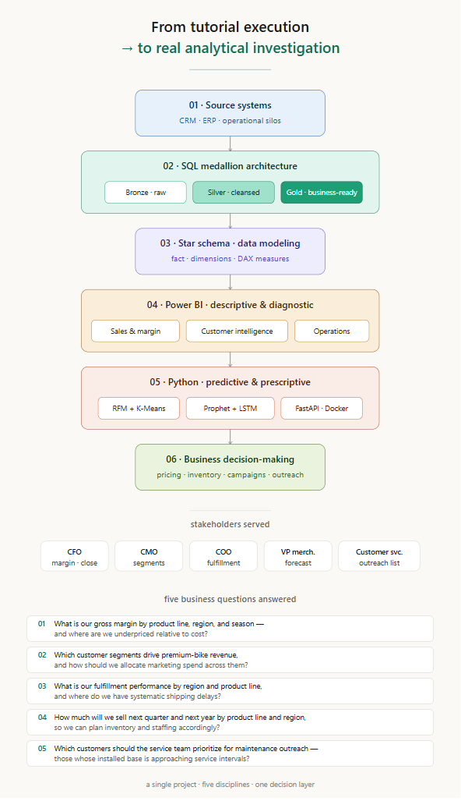

# AdventureWorks Cycles — End-to-End Analytics Platform

> A full data engineering, business intelligence, and machine learning project demonstrating production-grade analytics across SQL warehouse modeling, Power BI dashboards, and Python ML/DL, deployed via FastAPI and Docker.

[](https://www.python.org/)
[](https://www.postgresql.org/)
[](https://powerbi.microsoft.com/)
[](LICENSE)

---

## At a Glance

<p align="center">
  
</p>

This project takes raw data from a fictional cycling retailer's two operational systems (CRM and ERP), unifies them through a PostgreSQL data warehouse, and delivers analytics across three layers:

- **Descriptive & diagnostic** — Power BI dashboards serving the CFO, CMO, COO, and VP Merchandising.
- **Predictive** — customer segmentation (RFM + K-Means) and sales forecasting (Prophet + LSTM).
- **Prescriptive** — recommendations for inventory, marketing spend, and customer outreach.

The full pipeline is production-deployable via a FastAPI service running in Docker with Prometheus monitoring.

## Business Questions Answered

1. What is our gross margin by product line, region, and season — and where are we underpriced relative to cost?
2. Which customer segments drive premium-bike revenue, and how should we allocate marketing spend across them?
3. What is our fulfillment performance by region and product line, and where do we have systematic shipping delays?
4. How much will we sell next quarter and next year, by product line and region, so we can plan inventory and staffing accordingly?
5. Which customers should the service team prioritize for maintenance outreach — those whose installed base is approaching service intervals?

## Repository Structure

| Phase | Folder | What you'll find |
|---|---|---|
| 1. Data Engineering | [`01_data_engineering/`](01_data_engineering/) | PostgreSQL medallion warehouse (bronze → silver → gold) with stored procedures, audit triggers, data quality checks |
| 2. Business Intelligence | [`02_business_intelligence/`](02_business_intelligence/) | 3 Power BI dashboards, DAX measures, dashboard blueprint, mockups |
| 3. Machine Learning | [`03_machine_learning/`](03_machine_learning/) | Customer segmentation, sales forecasting, prescriptive recommendations |
| 4. Production Deployment | [`04_production_deployment/`](04_production_deployment/) | FastAPI service, Dockerfile, monitoring stack |

Each phase folder has its own README with detailed walkthrough.

## Project Documentation

| Document | Purpose |
|---|---|
| [`docs/01_business_context.md`](docs/01_business_context.md) | The fictional business situation, stakeholders, and pain points |
| [`docs/02_architecture.md`](docs/02_architecture.md) | Technical architecture across all four phases |
| [`docs/03_data_quality_findings.md`](docs/03_data_quality_findings.md) | Issues discovered in the source data and how they were handled |
| [`docs/04_results.md`](docs/04_results.md) | What each stakeholder gained from the project |
| [`docs/STAKEHOLDERS.md`](docs/STAKEHOLDERS.md) | Organigram and stakeholder responsibilities |

## Tech Stack

**Data Engineering:** PostgreSQL · plpgsql · bash · medallion architecture
**Business Intelligence:** Power BI Desktop · DAX · M (Power Query)
**Machine Learning:** Python · pandas · scikit-learn · Prophet · PyTorch · MLflow · joblib
**Production:** FastAPI · Pydantic · Docker · docker-compose · Prometheus · Grafana
**CI/CD:** GitHub Actions · pytest · black · ruff · sqlfluff

## Key Findings

- **Data quality discovery** — Identified that the source `create_date` field in `dim_customers` was contaminated with warehouse-load timestamps (all values in 2025-2026, while sales ran 2010-2014). This invalidated naive "customer acquisition" metrics. The fix: redefine "New Customer" using first-purchase date computed from `fact_sales`. See [data quality findings](docs/03_data_quality_findings.md).
- **Margin paradox** — The lowest-margin product line is Road bikes (the highest revenue contributor at ~36%), while accessories ("Other Sales") carry the highest margin (~50%). This is a strategic finding for the CFO: the bike is the customer-acquisition product; the margin lives in the accessory attach-rate.
- **Two segmentation approaches converge** — Business-rule RFM segmentation (built in Power BI) and unsupervised K-Means clustering (built in Python) agreed on approximately [TBD] of customer assignments, validating both approaches and reinforcing the same target audiences for marketing.

## Quick Start

Each phase is self-contained and has its own setup instructions. The recommended path through this project:

```
1. Read this README                                       (5 min)
2. Read docs/01_business_context.md                       (10 min)
3. Browse 01_data_engineering/ → run the SQL warehouse    (45 min setup)
4. Browse 02_business_intelligence/ → open the .pbix      (5 min)
5. Browse 03_machine_learning/ → run the notebooks        (30 min)
6. Browse 04_production_deployment/ → docker compose up   (10 min)
```

## Project Status

| Phase | Status |
|---|---|
| 1. Data Engineering — Bronze layer | ✅ Complete |
| 1. Data Engineering — Silver layer | 🚧 In progress |
| 1. Data Engineering — Gold layer | ✅ Complete (views + extracts) |
| 2. Business Intelligence | ✅ Complete (3 dashboards) |
| 3. Machine Learning — Segmentation | 🚧 In progress |
| 3. Machine Learning — Forecasting | 📋 Planned |
| 3. Machine Learning — Prescriptive | 📋 Planned |
| 4. Production Deployment | 📋 Planned |

## Author

**Anaclet Sado Fokam (John)** — Data analytics professional based in Ottawa, Canada. Transitioning from a 5+ year career in financial accounting into data analytics, with formal study at Collège La Cité (Data Science) and the University of Fredericton (MBA, AI specialization).

- LinkedIn: [Anaclet Sado Fokam](https://www.linkedin.com/in/)
- GitHub: [your-handle](https://github.com/)

## License

MIT — see [LICENSE](LICENSE).
